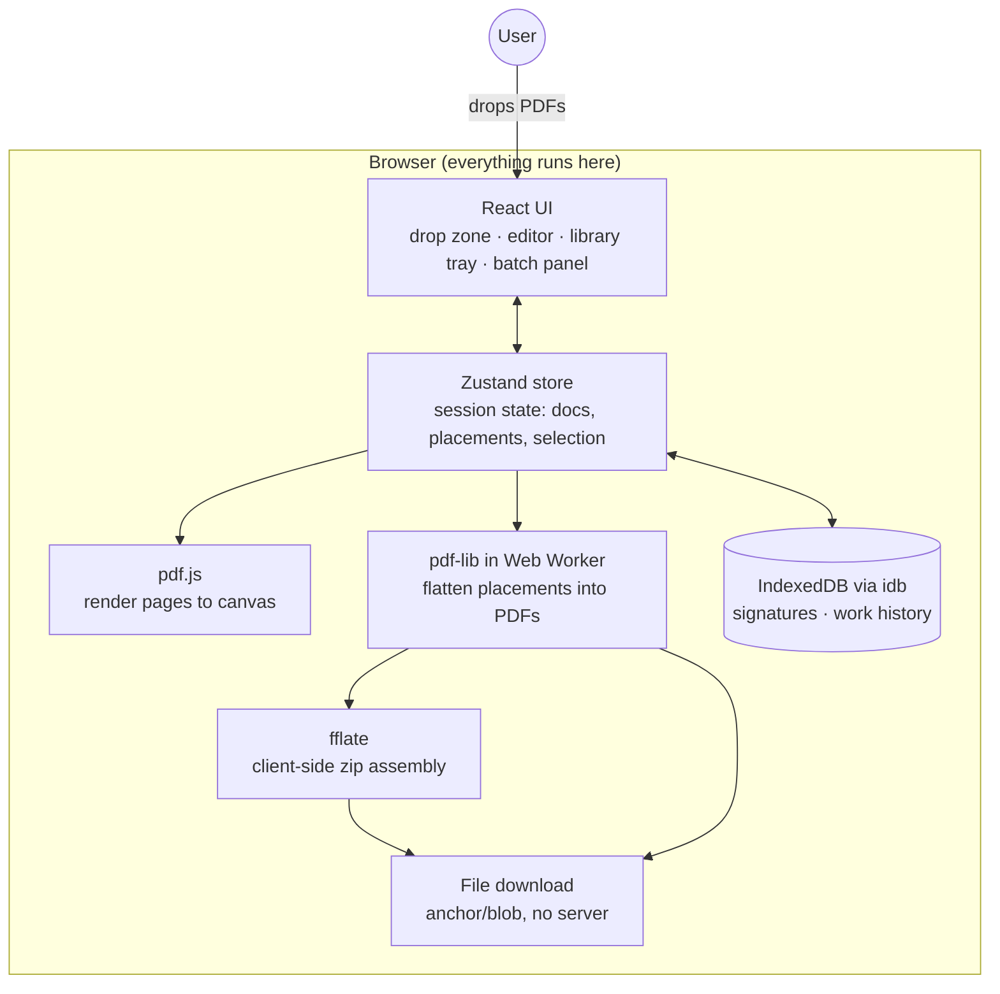

# PRD — SignLite

## 1. Overview

### Product Summary
**SignLite** — SignLite signs PDFs entirely in your browser: saved signatures, batch mode, instant download, nothing ever uploaded. It is a fully client-side web app (React + Vite, pdf.js for rendering, pdf-lib for writing, IndexedDB for persistence) with no backend, no accounts, and no network requests during operation. v1 is a personal tool for the founder; the architecture deliberately leaves the door open to a later public release.

### Objective
This PRD covers the MVP defined in `docs/product-vision.md` § Product Strategy: PDF upload and rendering, the signature/initials library with export/import, the placement editor (signature, initials, date, text), bulk mode with template placement and zip download, and reload-safe local work history. Everything in § Explicitly Out of Scope is excluded.

### Market Differentiation
The technical implementation must deliver three things no alternative combines: **verifiable privacy** (zero network requests from document drop to download — all assets bundled, no CDN, no telemetry), **a persistent signature library** (IndexedDB with export/import durability), and **batch signing** (template placement applied across a document stack, zipped client-side). If any of these three is compromised for implementation convenience, the product loses its reason to exist.

### Magic Moment
Drop a stack of 12 similar documents → place a saved signature once → "Apply to all" → download a zip of 12 signed PDFs, in under 90 seconds. Technical implications: multi-file drop is first-class; rendering must be lazy (render visible pages, not entire stacks); pdf-lib flattening of N documents must not freeze the main thread (web worker if profiling shows >200ms blocking); zip assembly is client-side; the whole pipeline works offline.

### Success Criteria
- Zero network requests from app load completion through signed-PDF download (verified via DevTools Network tab and an automated Playwright check).
- Single document: drop → signed download in < 60 s with a pre-existing library.
- Batch: 10 documents × ~5 pages → zip download in < 2 minutes total user time; flatten+zip processing < 15 s.
- Signature library survives: browser restart, export → simulated wipe → import.
- Mid-session reload restores open documents and placements.
- All P0 functional requirements implemented; app runs from static file hosting (or `vite preview`) with no server code.

## 2. Technical Architecture

### Architecture Overview

No server, no external services, no CDN. Static assets only.

### Chosen Stack
| Layer | Choice | Rationale |
|---|---|---|
| Frontend | React + Vite + TypeScript, Tailwind CSS | Pure static output, no server anywhere — matches the "verifiable in DevTools" promise; largest ecosystem for drag/drop and canvas work; best coding-agent support |
| Backend | None | Entire product is client-side by design; a backend would contradict the core privacy architecture |
| Database | None (IndexedDB on-device) | Signature library and work history live in the browser; JSON/PNG export-import is the durability escape hatch |
| Auth | None | No accounts is a feature; single-user personal tool |
| Payments | None | Free; revenue model deferred to the "if public later" appendix of docs/validation-report.md |

Analytics, email, and error tracking: all **None** — nothing phones home; "watch the Network tab, zero requests" must stay literally true.

### Stack Integration Guide
**Setup order:** (1) Vite + React + TS scaffold → (2) Tailwind → (3) `pdfjs-dist` with locally bundled worker → (4) `pdf-lib` + worker wrapper → (5) `idb` persistence layer → (6) `fflate` for zip.

Known integration patterns and gotchas — these will save hours:

1. **pdf.js worker must be bundled, not CDN-loaded.** Use Vite's `?url` import: `import workerUrl from 'pdfjs-dist/build/pdf.worker.min.mjs?url'` then `GlobalWorkerOptions.workerSrc = workerUrl`. Never use the unpkg/cdnjs default — it violates the zero-requests rule. Same for cmaps and standard fonts: copy `pdfjs-dist/cmaps` and `standard_fonts` into `public/` (or use `vite-plugin-static-copy`) and pass `cMapUrl`/`standardFontDataUrl` to `getDocument`.
2. **Coordinate systems disagree.** Screen/canvas coordinates are top-left origin, y-down; PDF (pdf-lib) coordinates are bottom-left origin, y-up, in PDF points. Store all placements in **normalized page-relative coordinates** (0–1 for x, y, w, h relative to the page's PDF-point dimensions) and convert at the render and flatten boundaries. This also makes template placement tolerant of minor page-size differences across a batch.
3. **pdf.js renders at a scale; don't confuse CSS pixels with PDF points.** `page.getViewport({ scale })` — keep the scale in the store alongside each rendered page and derive all pointer math from it. Account for `devicePixelRatio` when sizing canvases or output looks blurry.
4. **pdf-lib runs in a web worker for batch flattening.** Single-doc flatten can run on the main thread (typically < 100 ms). Batch flatten of N docs runs in a worker (`src/workers/flatten.worker.ts`, Vite `new Worker(new URL(...), { type: 'module' })` pattern), transferring `ArrayBuffer`s (transferable, zero-copy) in and out. Post progress messages per document to drive the batch progress UI.
5. **Signature capture** uses `signature_pad` (canvas-based, smooth Bézier strokes, works with mouse/trackpad). Export as PNG data URL at 2× resolution; also keep the raw point data in the DB so signatures can be re-rendered crisply later.
6. **Typed signatures** use 2–3 script fonts **bundled locally** as woff2 files (pick OFL-licensed fonts, e.g. Caveat, Dancing Script, Homemade Apple) loaded via `@font-face` from `/public/fonts/`. No Google Fonts CDN — zero requests. Render typed signatures to a canvas → PNG so the placement pipeline handles drawn/typed/uploaded identically (everything is a PNG with a natural aspect ratio).
7. **Embedding into PDFs:** all signature variants embed via `pdfDoc.embedPng(bytes)`. Text boxes and date stamps embed as real text via `StandardFonts.Helvetica` (no font-file subsetting needed for ASCII; for non-ASCII text, embed a bundled Unicode font with `@pdf-lib/fontkit`).
8. **IndexedDB via `idb`** (thin promise wrapper). Call `navigator.storage.persist()` after the first signature save to reduce eviction risk. All Files are stored as `ArrayBuffer`/`Blob` — both are structured-clone friendly.
9. **Zip via `fflate`** (`zipSync`/`Zip` streaming API) — small, fast, tree-shakeable; runs fine inside the same flatten worker.
10. **No environment variables.** There is nothing to configure and no secrets. The absence of a `.env` is correct.

### Repository Structure
```
signlite/
├── docs/                          # BuilderOS documents (this file & friends)
├── public/
│   ├── fonts/                     # Bundled script fonts (woff2) for typed signatures
│   ├── cmaps/                     # Copied from pdfjs-dist (build step)
│   └── standard_fonts/            # Copied from pdfjs-dist (build step)
├── src/
│   ├── main.tsx                   # Entry; mounts <App/>
│   ├── App.tsx                    # Top-level layout + view routing (drop → editor)
│   ├── components/
│   │   ├── ui/                    # Primitives per docs/design.md (Button, Tray, Modal, Toast)
│   │   ├── DropZone.tsx           # Full-window multi-file drop + file picker
│   │   ├── editor/
│   │   │   ├── EditorView.tsx     # Main editor: page canvas + overlay + trays
│   │   │   ├── PageCanvas.tsx     # pdf.js render target (one per visible page)
│   │   │   ├── PlacementLayer.tsx # Absolutely-positioned overlay of placed elements
│   │   │   ├── PlacedElement.tsx  # Draggable/resizable wrapper (react-moveable)
│   │   │   └── PageThumbnails.tsx # Sidebar page navigation
│   │   ├── library/
│   │   │   ├── LibraryTray.tsx    # Side tray: saved signatures/initials, add/delete
│   │   │   ├── DrawPad.tsx        # signature_pad wrapper modal
│   │   │   ├── TypePad.tsx        # Typed-signature modal (script font picker)
│   │   │   └── ImportExport.tsx   # Library backup/restore UI
│   │   └── batch/
│   │       ├── BatchPanel.tsx     # Document list, order, per-doc status
│   │       └── ApplyToAll.tsx     # Template apply + progress + zip download
│   ├── stores/
│   │   └── session.ts             # Zustand: open docs, placements, selection, batch state
│   ├── db/
│   │   ├── schema.ts              # idb database definition (stores, indexes, migrations)
│   │   ├── signatures.ts          # Library CRUD + export/import
│   │   └── history.ts             # Work-history persistence (debounced autosave)
│   ├── pdf/
│   │   ├── render.ts              # pdf.js loading + page render helpers
│   │   ├── flatten.ts             # Placement → pdf-lib drawing (shared with worker)
│   │   └── coords.ts              # Normalized ↔ screen ↔ PDF-point conversions
│   ├── workers/
│   │   └── flatten.worker.ts      # Batch flatten + fflate zip, progress messages
│   └── lib/
│       ├── files.ts               # Blob download, filename derivation (-signed suffix)
│       └── strings.ts             # All UI copy in one place (quiet-utility voice)
├── tests/                         # Vitest unit (coords, flatten) + Playwright e2e
├── index.html
├── vite.config.ts
├── tailwind.config.ts
└── package.json
```

### Infrastructure & Deployment
- **Development:** `npm run dev` (Vite). That's the whole stack.
- **Deployment:** `npm run build` → `dist/` of static files. Host anywhere free: Cloudflare Pages or GitHub Pages recommended (both $0, both pure static). `vite preview` or any static file server also works — the app is fully functional from `localhost`.
- **CI (lightweight):** a single GitHub Actions workflow running typecheck, Vitest, and the Playwright zero-network test on push. Optional for a personal tool but cheap insurance.
- **Environment variables:** none, by design.

### Security Considerations
- **Threat model:** the user's own confidential documents must not leave the device. Enforcement: no `fetch`/XHR calls exist in app code; a strict Content-Security-Policy meta tag (`default-src 'self'; connect-src 'none'` — note pdf.js needs `worker-src 'self' blob:` and canvas work needs `img-src 'self' data: blob:`) turns "we don't upload" into "the browser won't allow an upload." An automated test asserts zero network requests during a sign flow.
- **Input handling:** PDFs are untrusted input. pdf.js parses them in its own worker (sandboxed from the DOM); catch and surface parse failures per file with quiet-utility copy, never a crash. Reject encrypted PDFs with a clear message. Cap accepted file size (e.g., 100 MB/file) to avoid tab-killing allocations.
- **Uploaded signature images:** accept PNG/JPEG only, re-encode through a canvas before storing (strips any active content/metadata), cap dimensions.
- **Local data:** IndexedDB contents (signatures, in-progress documents) are as private as the browser profile. Document this plainly in the UI's library panel ("Stored in this browser, on this machine."). Export files are unencrypted JSON/PNG — the confirm copy should say so.

### Cost Estimate
$0/month, indefinitely. Static hosting: Cloudflare Pages or GitHub Pages free tier (limits far above one user's needs). No other services exist. The only conceivable cost is a custom domain (~$10/year, optional).

## 3. Data Model

All persistence is IndexedDB (database `signlite`, version 1) via `idb`. TypeScript-first definitions; `src/db/schema.ts` is the source of truth.

### Entity Definitions
```typescript
// Object store: "signatures" (keyPath: "id")
interface SignatureAsset {
  id: string;                    // crypto.randomUUID()
  kind: "signature" | "initials";
  source: "drawn" | "typed" | "uploaded";
  pngBytes: ArrayBuffer;         // Rendered PNG, 2x resolution, transparent bg. Required.
  width: number;                 // Natural pixel width of the PNG. Required.
  height: number;                // Natural pixel height. Required — preserves aspect ratio.
  strokeData?: string;           // signature_pad .toData() JSON — only for source "drawn"
  typedText?: string;            // Only for source "typed"
  typedFont?: string;            // Font family name — only for source "typed"
  label: string;                 // Display name, default "Signature"/"Initials". Required.
  createdAt: number;             // Date.now()
  lastUsedAt: number;            // Bumped on each placement; drives tray sort order
}

// Object store: "sessions" (keyPath: "id") — reload-safe work history
interface WorkSession {
  id: string;                    // crypto.randomUUID()
  createdAt: number;
  updatedAt: number;             // Debounced autosave timestamp (500 ms after last change)
  documents: SessionDocument[];  // Ordered — order defines batch sequence
  templatePlacements: Placement[]; // Batch template (pageIndex-anchored); empty for single-doc
}

interface SessionDocument {
  docId: string;                 // crypto.randomUUID()
  fileName: string;              // Original name; download becomes `${stem}-signed.pdf`
  pdfBytes: ArrayBuffer;         // The original file. Required.
  pageCount: number;
  pageSizes: { w: number; h: number }[]; // PDF points, per page — for coord math
  placements: Placement[];       // Per-document placements (template-applied or manual)
  status: "pending" | "placed" | "signed"; // Batch progress state
}

interface Placement {
  id: string;
  type: "signature" | "initials" | "date" | "text";
  assetId?: string;              // → signatures store; required for signature/initials
  pageIndex: number;             // 0-based
  x: number; y: number;          // Normalized 0–1, relative to page, top-left origin
  w: number; h: number;          // Normalized 0–1 (h derived from asset aspect ratio for images)
  value?: string;                // Text content (type "text") or formatted date (type "date")
  fontSize?: number;             // PDF points; for text/date. Default 12.
}

// Object store: "prefs" (key-value)
interface Prefs {
  dateFormat: string;            // Default "yyyy-MM-dd" (date-fns format string)
  lastExportAt?: number;         // Drives the "library not backed up" nudge
}
```

**Validation rules:** `pngBytes` must decode as an image before save; placements are clamped to page bounds (0 ≤ x, x+w ≤ 1, same for y); `fileName` sanitized for the download attribute; a `WorkSession` with zero documents is deleted, not saved.

**Library export format:** a single JSON file `signlite-library-{date}.json` — `{ version: 1, signatures: [...] }` with `pngBytes` base64-encoded. Import merges by `id` (skip duplicates, never overwrite silently).

### Relationships
- `Placement.assetId → SignatureAsset.id` (many:1). No cascade: deleting an asset leaves existing placements intact in flattened output but removes it from the tray; active sessions referencing a deleted asset keep a cached copy of the PNG in memory for the session.
- `WorkSession 1:many SessionDocument` (embedded — documents live inside the session record; a session is loaded/saved atomically).
- `WorkSession.templatePlacements → SessionDocument.placements` (template is copied per-document on "apply to all," then per-doc overrides diverge freely).

### Indexes
- `signatures` by `kind` — tray renders signatures and initials in separate groups.
- `signatures` by `lastUsedAt` — most-recently-used first in the tray.
- `sessions` by `updatedAt` — restore the most recent session on reload; prune sessions older than 7 days on startup (documents are large; history is a crash-safety net, not an archive).

## 4. API Specification

### API Design Philosophy
There is no network API — no REST, no RPC, no GraphQL, and adding one is a spec violation (see § Security). The contract layer is instead **internal module interfaces**: the UI talks to three facades, and these signatures are the stable seams the implementation must honor.

```typescript
// src/db/signatures.ts — library facade
listAssets(): Promise<SignatureAsset[]>                          // sorted by lastUsedAt desc
saveAsset(input: Omit<SignatureAsset, "id"|"createdAt"|"lastUsedAt">): Promise<SignatureAsset>
deleteAsset(id: string): Promise<void>
exportLibrary(): Promise<Blob>                                   // JSON, base64 pngBytes
importLibrary(file: File): Promise<{ added: number; skipped: number }>

// src/db/history.ts — work-session facade
saveSession(session: WorkSession): Promise<void>                 // debounced 500 ms by caller
loadLatestSession(): Promise<WorkSession | null>
clearSession(id: string): Promise<void>

// src/pdf/render.ts — rendering facade
loadDocument(bytes: ArrayBuffer): Promise<LoadedPdf>             // throws TypedError: "encrypted" | "corrupt"
renderPage(pdf: LoadedPdf, pageIndex: number, scale: number, canvas: HTMLCanvasElement): Promise<void>
renderThumbnail(pdf: LoadedPdf, pageIndex: number): Promise<ImageBitmap>

// src/workers/flatten.worker.ts — message protocol
// Request:  { kind: "flatten", docs: { docId, pdfBytes, placements, pageSizes }[],
//             assets: Record<assetId, ArrayBuffer>, zip: boolean }
// Progress: { kind: "progress", docId, done: number, total: number }
// Success:  { kind: "done", output: ArrayBuffer, mime: "application/pdf" | "application/zip" }
// Failure:  { kind: "error", docId?: string, message: string }   // per-doc failure: batch continues, failed doc reported
```

**Error format:** facades throw `SignliteError { code: "encrypted" | "corrupt" | "too-large" | "quota" | "import-invalid", message: string }` — codes map 1:1 to quiet-utility copy in `src/lib/strings.ts`. **Pagination:** not applicable at this scale (a library has dozens of items, not thousands).

## 5. User Stories

### Epic: Library
**US-001: Save a drawn signature**
As the founder, I want to draw my signature once and have it saved permanently so that I never draw it again.
Acceptance Criteria:
- [ ] Given an empty library, when I open the draw pad, draw, and confirm, then the signature appears in the tray and persists after a full browser restart.
- [ ] Given the draw pad, when I undo strokes, then strokes are removed most-recent-first.
- [ ] Edge case: confirming an empty draw pad → confirm is disabled, no empty asset saved.

**US-002: Typed and uploaded signatures**
As the founder, I want to type my signature in a script font or upload an image so that I can use a signature that matches documents I've signed before.
Acceptance Criteria:
- [ ] Given the type pad, when I enter text and pick one of the bundled fonts, then a preview renders and confirming saves it as a PNG asset.
- [ ] Given an upload, when I select a PNG/JPEG, then it is re-encoded, background-trimmed where transparent, and saved.
- [ ] Edge case: uploading a 40 MB TIFF → rejected with "PNG or JPEG only, up to 10 MB."

**US-003: Export and import the library**
As the founder, I want to back up and restore my signature library so that clearing browser data can't destroy it.
Acceptance Criteria:
- [ ] Given saved assets, when I export, then a JSON file downloads containing all assets.
- [ ] Given a fresh browser profile, when I import that file, then all assets reappear identical (pixel-identical PNGs).
- [ ] Edge case: importing a malformed/foreign JSON → "This isn't a SignLite library file." — nothing partially imported.

### Epic: Single-Document Signing
**US-004: Sign one document fast**
As the founder, I want to drop a PDF, place my saved signature and today's date, and download so that a routine "sign and return" takes under a minute.
Acceptance Criteria:
- [ ] Given a saved library, when I drop a PDF, then page 1 renders and the tray shows my assets — within 2 s for a typical file.
- [ ] Given a rendered page, when I drag an asset onto it, then it places where dropped, is resizable from corner handles (aspect locked), movable, deletable, and nudgeable via arrow keys.
- [ ] Given placements, when I download, then the PDF is flattened with elements in exactly the on-screen positions and named `{original}-signed.pdf`.
- [ ] Edge case: password-protected PDF → "This PDF is password-protected. Unlock it and drop it again."
- [ ] Edge case: dropping a non-PDF → "PDF only for now." (file rejected, app state untouched).

**US-005: Date stamps and text boxes**
As the founder, I want to add dates and short text (name, title, "approved") so that I can fill simple fields, not just sign.
Acceptance Criteria:
- [ ] Given the editor, when I add a date, then it defaults to today in the preferred format and is editable before download.
- [ ] Given a text box, when I type multi-word text, then it renders in the PDF as crisp real text (not an image) at the chosen size.
- [ ] Edge case: empty text box at download time → excluded from output.

### Epic: Batch Signing (magic moment)
**US-006: Sign a stack with one placement**
As the founder, I want to drop 12 similar documents, place my signature once, and apply it to all so that a batch session takes minutes, not an afternoon.
Acceptance Criteria:
- [ ] Given 12 dropped PDFs, when the batch panel lists them in drop order, then I can reorder and remove before signing.
- [ ] Given template placements on the first document, when I click "Apply to all," then every document receives the placements at the same normalized position (same page index), progress is shown per document, and the result downloads as `signlite-batch-{date}.zip`.
- [ ] Given an applied batch, when I open any document in the batch before download, then I can adjust its placements individually without affecting the others.
- [ ] Edge case: one document has fewer pages than the template's page index → that document is flagged "needs review," skipped by apply-to-all, and signable manually; the rest proceed.
- [ ] Edge case: one document fails to flatten → the zip still downloads with the other 11; the failure is named per-document.

### Epic: Durability
**US-007: Survive a reload**
As the founder, I want an accidental reload mid-batch to cost me nothing so that I trust the tool with a 20-minute session.
Acceptance Criteria:
- [ ] Given open documents with placements, when I reload the tab, then the session restores: same documents, same placements, same batch order.
- [ ] Given a restored session, when I choose "Start fresh," then the old session is cleared.
- [ ] Edge case: IndexedDB quota exceeded during autosave → visible warning ("Autosave is off — this session won't survive a reload."), signing continues unimpeded.

## 6. Functional Requirements

**FR-001: Multi-file PDF drop & picker** — Priority: P0
Full-window drag-and-drop plus a file-picker button; accepts 1–N PDFs (`application/pdf`), max 100 MB each, 50 files per session. Rejects others per-file with quiet-utility copy.
Acceptance: drop of mixed valid/invalid files loads the valid ones and names the rejects. Related: US-004, US-006.

**FR-002: Page rendering** — Priority: P0
Render pages via pdf.js at fit-width scale with devicePixelRatio correctness; lazy-render only visible pages ±1; thumbnail sidebar for navigation.
Acceptance: a 50-page PDF scrolls smoothly; memory does not grow unbounded (offscreen canvases released). Related: US-004.

**FR-003: Signature capture (draw)** — Priority: P0
`signature_pad` modal at 2× resolution, undo, clear, save-to-library with kind (signature/initials).
Acceptance: US-001 criteria. Related: US-001.

**FR-004: Signature capture (type & upload)** — Priority: P0
Typed: bundled script fonts, live preview, rendered to PNG. Upload: PNG/JPEG ≤ 10 MB, canvas re-encode.
Acceptance: US-002 criteria. Related: US-002.

**FR-005: Library persistence & management** — Priority: P0
IndexedDB store per § Data Model; tray grouped by kind, MRU-sorted; rename and delete (delete confirms, mentions export). `navigator.storage.persist()` requested on first save.
Acceptance: survives restart; delete requires confirm. Related: US-001, US-003.

**FR-006: Library export/import** — Priority: P0
JSON export (base64 PNGs, versioned envelope); merge-import with per-item skip-on-duplicate; "last backed up" indicator in the tray, nudge after 30 days or 10 new assets.
Acceptance: US-003 criteria, round-trip pixel-identical. Related: US-003.

**FR-007: Placement editor** — Priority: P0
Drag from tray onto page; move/resize via `react-moveable` (corner handles, aspect-locked for image assets); arrow-key nudge (1px, shift=10px); delete key removes selection; placements stored normalized per § Data Model.
Acceptance: on-screen position matches flattened output within 1 PDF point at any zoom. Related: US-004.

**FR-008: Date stamps & text boxes** — Priority: P0
Date element defaults to today (`prefs.dateFormat`), click-to-edit; text element with inline editing, font size control; both flatten as real text (Helvetica) via pdf-lib.
Acceptance: US-005 criteria. Related: US-005.

**FR-009: Single-document flatten & download** — Priority: P0
Flatten placements via pdf-lib (main thread OK for one doc); download as `{stem}-signed.pdf`; original file never mutated in the session store.
Acceptance: US-004 criteria; output opens correctly in Preview/Acrobat/Chrome. Related: US-004.

**FR-010: Batch panel & ordering** — Priority: P0
When ≥ 2 documents load, show the batch panel: ordered list, reorder (drag), remove, per-doc status per § Data Model.
Acceptance: US-006 first criterion. Related: US-006.

**FR-011: Template apply-to-all** — Priority: P0
Placements on the designated template document copy to all pending documents at normalized coordinates; page-index mismatch flags "needs review"; per-document divergence after apply.
Acceptance: US-006 criteria. Related: US-006.

**FR-012: Batch flatten & zip download** — Priority: P0
Web worker flattens all documents with per-doc progress; fflate zips; partial failure tolerated (failed docs named, rest delivered); output `signlite-batch-{yyyy-MM-dd}.zip`.
Acceptance: 10 docs × 5 pages flatten+zip < 15 s on the founder's machine; per-doc failure doesn't abort the batch. Related: US-006.

**FR-013: Reload-safe work history** — Priority: P0
Debounced (500 ms) autosave of the active session (documents + placements + template) to IndexedDB; restore prompt on load ("Resume last session? — Resume / Start fresh"); sessions > 7 days pruned.
Acceptance: US-007 criteria. Related: US-007.

**FR-014: Zero-network guarantee** — Priority: P0
No fetch/XHR in app code; all assets (pdf.js worker, cmaps, fonts) bundled; CSP meta tag per § Security; Playwright test asserts zero requests during a full sign flow post-load.
Acceptance: the automated check passes; manual DevTools inspection during a batch shows an empty Network tab. Related: all.

**FR-015: Quiet-utility copy system** — Priority: P1
All user-facing strings centralized in `src/lib/strings.ts`, written to the voice guide in `docs/product-vision.md` § Voice & Tone.
Acceptance: no string literals in components; copy review against the DO/DON'T table. Related: all.

**FR-016: Keyboard shortcuts** — Priority: P1
Cmd/Ctrl+S = download current, Cmd/Ctrl+Shift+S = batch download, Delete = remove selection, arrows = nudge, Esc = deselect/close modal.
Acceptance: all shortcuts work; a `?` overlay lists them. Related: US-004, US-006.

**FR-017: Recent-session list** — Priority: P2
Beyond FR-013's single restore: list up to 5 recent sessions with document names and timestamps.
Acceptance: selecting one restores it. Related: US-007.

## 7. Non-Functional Requirements

### Performance
- App load (static assets, warm cache) to interactive drop zone: < 1 s; cold: < 2.5 s. Initial JS bundle < 300 KB gzipped (pdf.js worker and pdf-lib lazy-loaded on first document drop).
- First page render after drop: < 2 s for a typical (< 10 MB) PDF.
- Placement drag: 60 fps; no main-thread task > 50 ms during editing.
- Batch flatten+zip: 10 docs × 5 pages < 15 s; UI remains responsive (worker) with per-doc progress.

### Security
- Zero network requests post-load (FR-014); CSP with `connect-src 'none'` enforced.
- Untrusted-PDF handling per § Security Considerations; encrypted and corrupt files fail closed with clear copy.
- Uploaded images re-encoded; size and type caps enforced before storage.

### Accessibility
- Full keyboard operation: tray navigation, placement selection and nudge, all modals focus-trapped with Esc-to-close.
- WCAG 2.1 AA contrast for all UI text (per tokens in `docs/design.md`); visible focus states.
- Placement canvas is inherently visual; provide an aria-live status region announcing placements ("Signature placed on page 2") as the pragmatic AA path.

### Scalability
- Session ceiling: 50 documents / 500 total pages / ~500 MB in-memory budget; exceeding caps yields a clear per-file rejection, not degradation.
- Library ceiling: effectively unbounded (dozens of small PNGs); no design constraint.

### Reliability
- Autosave means a crash/reload loses ≤ 500 ms of work.
- Partial batch failure never destroys the batch (FR-012).
- No third-party services exist to fail; the app works fully offline once loaded.

## 8. UI/UX Requirements

> Visual tokens not yet defined. Run the Design System skill (`docs/design.md`) before implementation begins. Direction from brand: quiet utility — dense, restrained, chrome-free. Component names below are placeholders to be reconciled with `docs/design.md`.

### Screen: Drop Zone (home)
Route: `/` (single-page app; "routes" are view states)
Purpose: get documents into the app with zero ceremony.
Layout: full-viewport drop target; centered terse prompt; small footer row with "Import library" and a keyboard-hint glyph. If a resumable session exists, a single restore bar at top.
States:
- **Empty:** "Drop a PDF anywhere." + subdued "or choose files" button.
- **Loading:** per-file progress list replaces the prompt (fast files may skip straight to editor).
- **Populated:** n/a — transitions to Editor view on first successful load.
- **Error:** rejected files listed inline ("lease.docx — PDF only for now."), accepted files proceed.
Key Interactions: drag-enter highlights the whole window → drop loads files → auto-transition to Editor; "Resume last session?" bar → Resume restores, Start fresh clears.
Components Used: drop-target, button-secondary, toast, restore-bar.

### Screen: Editor
Route: `/` (state: ≥ 1 document loaded)
Purpose: place elements and download — the core screen.
Layout: three columns. Left: page thumbnails (current doc). Center: rendered page canvas with placement overlay, zoom control bottom-center. Right: library tray (signatures group, initials group, date/text buttons, add "+", import/export row, backed-up indicator). Top bar: document name, page x/y, Download button. When ≥ 2 docs: batch panel docks left of thumbnails (see below).
States:
- **Empty (no placements):** page renders; tray visible; if library empty, tray shows "No saved signatures. Draw one to get started." with the draw button prominent.
- **Loading:** page-sized skeleton while a page renders; thumbnails fill progressively.
- **Populated:** placements shown with selection handles on the selected element.
- **Error:** per-document load failure shows an inline card in place of the canvas with the specific message and a "Remove from session" action.
Key Interactions: drag asset from tray → drop on page → placement created at drop point sized proportionally (~20% page width for signatures) → drag to move, corner handles to resize, arrows to nudge, Delete to remove; click date/text button → element appears centered on current page in edit mode; Download → flatten → browser download + toast "Done. Downloaded {name}-signed.pdf."
Components Used: tray, thumbnail-rail, canvas-stage, placement-handles, button-primary, toast, modal (draw/type pads).

### Screen: Batch Panel (editor extension)
Route: `/` (state: ≥ 2 documents loaded)
Purpose: order the stack, apply the template, track progress, download the zip.
Layout: narrow docked panel: ordered document list (name, page count, status chip: pending / placed / needs review / signed), drag handles for reorder, per-doc remove; footer with "Apply to all" and "Download all (.zip)".
States:
- **Empty:** n/a (panel only exists with documents).
- **Loading (applying/flattening):** per-doc progress states tick through; footer button shows "Signing 4 of 12…".
- **Populated:** statuses current; clicking a doc switches the editor canvas to it.
- **Error:** failed docs get a red status chip with the message on hover/tap; zip still offered for the successes.
Key Interactions: reorder via drag → batch order updates; "Apply to all" → template placements copied to all pending docs, mismatches flagged "needs review"; click flagged doc → editor opens it for manual placement; "Download all" → worker progress → zip download + "Done. 12 documents signed." (count reflects successes).
Components Used: doc-list, status-chip, button-primary, progress-inline.

### Modal: Draw Pad / Type Pad / Import-Export
Purpose: create library assets; back up and restore.
Layout: centered modal, focus-trapped. Draw: large canvas, Undo / Clear / kind toggle (signature ⇄ initials) / Save. Type: text input, font picker (3 bundled scripts, rendered live), kind toggle, Save. Import/Export: two buttons with one-line explanations; import shows result summary ("Added 4. Skipped 2 duplicates.").
States: Empty (Save disabled), Populated (Save enabled), Error (import: "This isn't a SignLite library file.").
Key Interactions: Esc cancels without saving; Save closes and the new asset appears in the tray already selected for placement.
Components Used: modal, canvas-pad, input-text, segmented-control, button-primary, button-secondary.

### Onboarding
None, deliberately. The empty states *are* the onboarding (product principle: no tours). First-run experience = Drop Zone empty state + empty-tray prompt.

### Settings
No dedicated settings screen in v1. Date format lives as an inline control on date elements ("2026-07-06 ▾" cycles formats and persists to `prefs`). Library management (rename/delete/export/import) lives in the tray.

## 9. Auth Implementation

This app does not require authentication — no accounts is a core product decision (see `docs/product-vision.md` § Core Values). If auth is ever added for a public multi-device sync feature, revisit this section; until then, any PR introducing an identity concept should be rejected on principle.

## 10. Payment Integration

Not applicable — the revenue model is free and no payment provider was chosen. If the product goes public and the fake-door Pro test (see `docs/validation-report.md` appendix) converts, revisit with a merchant-of-record provider; nothing in v1 should anticipate it.

## 11. Edge Cases & Error Handling

### Feature: File intake
| Scenario | Expected Behavior | Priority |
|---|---|---|
| Non-PDF dropped | Per-file rejection toast "PDF only for now."; valid files in the same drop proceed | P0 |
| Password-protected PDF | "This PDF is password-protected. Unlock it and drop it again." — file not added | P0 |
| Corrupt/truncated PDF | "Couldn't read {name}. The file may be damaged." — file not added | P0 |
| File > 100 MB | "{name} is too large (limit 100 MB)." | P0 |
| 51st file in a session | "Session limit is 50 documents." — extras ignored, named | P1 |
| Zero-page or malformed-page PDF | Treated as corrupt; same copy | P1 |

### Feature: Library
| Scenario | Expected Behavior | Priority |
|---|---|---|
| IndexedDB unavailable (private window / blocked) | Banner: "This browser can't save your library. Signing works; saved signatures won't survive this tab." — in-memory library for the session | P0 |
| Storage quota exceeded on save | "Couldn't save — browser storage is full." Asset usable in-session | P1 |
| Import file malformed or wrong schema version | "This isn't a SignLite library file." — atomic reject, nothing partial | P0 |
| Delete asset referenced by open session | Placements keep a cached PNG for the session; tray entry gone | P1 |

### Feature: Editor & flatten
| Scenario | Expected Behavior | Priority |
|---|---|---|
| Placement dragged beyond page edge | Clamped to page bounds on release | P0 |
| Download with zero placements | Button disabled with tooltip "Nothing placed yet." | P1 |
| pdf-lib flatten throws (exotic PDF internals) | "Couldn't write {name}. Try re-saving the PDF from its source." — session intact | P0 |
| Zoom change with existing placements | Placements track exactly (normalized coords make this automatic — test it) | P0 |
| Very small placement (< 8 px) | Minimum size enforced at 12 PDF points | P2 |

### Feature: Batch
| Scenario | Expected Behavior | Priority |
|---|---|---|
| Template page index missing in a doc (doc has fewer pages) | Doc flagged "needs review," excluded from apply-to-all, manually signable | P0 |
| Page size differs across stack | Normalized coordinates place proportionally; flagged subtly ("differs from template — review") if aspect deviates > 10% | P1 |
| One doc fails during batch flatten | Batch continues; zip contains successes; failure named per-doc | P0 |
| Reload mid-flatten | Worker output lost; session (placements) restored via FR-013; user re-triggers download | P1 |
| Tab backgrounded during long flatten | Worker continues (not throttled like timers); progress correct on return | P2 |

### Feature: Session restore
| Scenario | Expected Behavior | Priority |
|---|---|---|
| Restore prompt declined ("Start fresh") | Old session cleared after new session's first save (not immediately — accidental-click safety) | P1 |
| Autosave fails repeatedly | One-time warning banner (US-007 edge case), then silence — never a nag loop | P1 |
| Session > 7 days old | Pruned silently at startup | P2 |

## 12. Dependencies & Integrations

### Core Dependencies
```json
{
  "react": "latest",
  "react-dom": "latest",
  "zustand": "state store — small, no boilerplate",
  "pdfjs-dist": "PDF rendering (bundle worker, cmaps, standard_fonts locally)",
  "pdf-lib": "PDF writing/flattening",
  "@pdf-lib/fontkit": "custom font embedding for non-ASCII text (lazy-loaded)",
  "idb": "promise wrapper over IndexedDB",
  "signature_pad": "smooth canvas signature capture",
  "react-moveable": "drag/resize handles for placements",
  "fflate": "client-side zip",
  "date-fns": "date formatting for date stamps"
}
```
(Install latest compatible versions at build time — do not pin here.)

### Development Dependencies
```json
{
  "typescript": "strict mode on",
  "vite": "build tool",
  "@vitejs/plugin-react": "",
  "tailwindcss": "+ postcss/autoprefixer per current Tailwind setup",
  "vite-plugin-static-copy": "copy pdfjs cmaps & standard_fonts into public/",
  "vitest": "unit tests (coords math, export/import round-trip)",
  "@playwright/test": "e2e incl. the zero-network assertion",
  "eslint": "+ typescript-eslint, react hooks plugin",
  "prettier": ""
}
```

### Third-Party Services
None at runtime — this is load-bearing (FR-014). Build/host only: GitHub (repo + Actions CI) and Cloudflare Pages or GitHub Pages (static hosting, free tier, no API keys in the app). Bundled assets shipped with the app, not fetched: 2–3 OFL-licensed script fonts (woff2), pdf.js worker/cmaps/standard fonts.

## 13. Out of Scope

Per `docs/product-vision.md` § Explicitly Out of Scope:
- **DOC/DOCX conversion** — top technical risk (browser Word fidelity); reconsider only after a 3-real-document fidelity test passes. Workaround: print-to-PDF first.
- **Mobile touch signing / PWA / pressure-aware strokes** — serve a public audience that doesn't exist yet; reconsider on a public release. (The app should not be *broken* on mobile — it just isn't designed for it.)
- **Audit-trail page, guided field navigation, element rotation** — scope creep vs. the batch workflow; reconsider post-v1 if a real session misses them.
- **Multi-party envelopes, email delivery, notarization, cryptographic certificates (.p12), CRM integrations** — permanently out; different product.
- **Telemetry of any kind (analytics, error tracking)** — excluded on principle; Sentry is the first add if public.
- **Accounts, sync, server-side anything** — see § 9.

## 14. Open Questions

1. **Which script fonts for typed signatures?** Options: Caveat, Dancing Script, Homemade Apple, Great Vibes (all OFL). Tradeoff: taste only. Recommended default: bundle Caveat + Homemade Apple, decide the third in the design pass.
2. **Should originals be retained in the session store as `ArrayBuffer`s for large batches, or re-read from a FileSystemHandle?** `ArrayBuffer` in IndexedDB is simple and works everywhere; File System Access API would shrink storage but is Chromium-only. Recommended default: ArrayBuffers with the 500 MB session budget; revisit only if real batches blow the budget.
3. **Initials auto-derivation:** when saving a typed signature, auto-offer an initials variant from the same text? Nice touch vs. scope. Recommended default: yes if trivial during FR-004, otherwise Could Have.
4. **Date format preference surface:** inline-on-element only (current spec) or also a tray-level default? Recommended default: inline only; the pref persists globally anyway.
5. **Hosting target:** Cloudflare Pages vs. GitHub Pages vs. localhost-only. No functional difference; recommended default: Cloudflare Pages (free, custom domain trivial later), decided at the polish phase.
